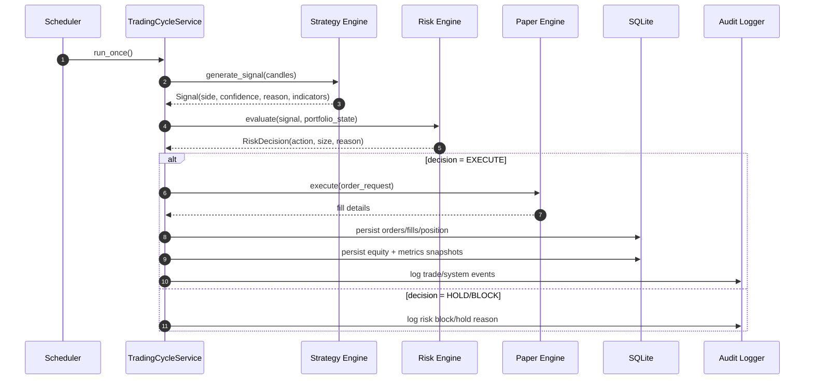
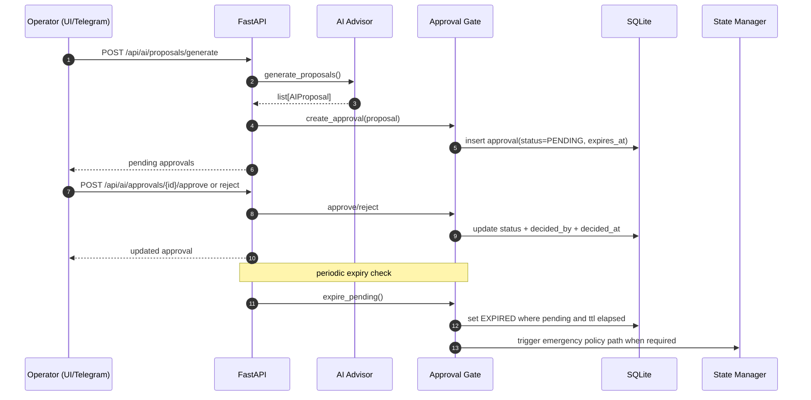
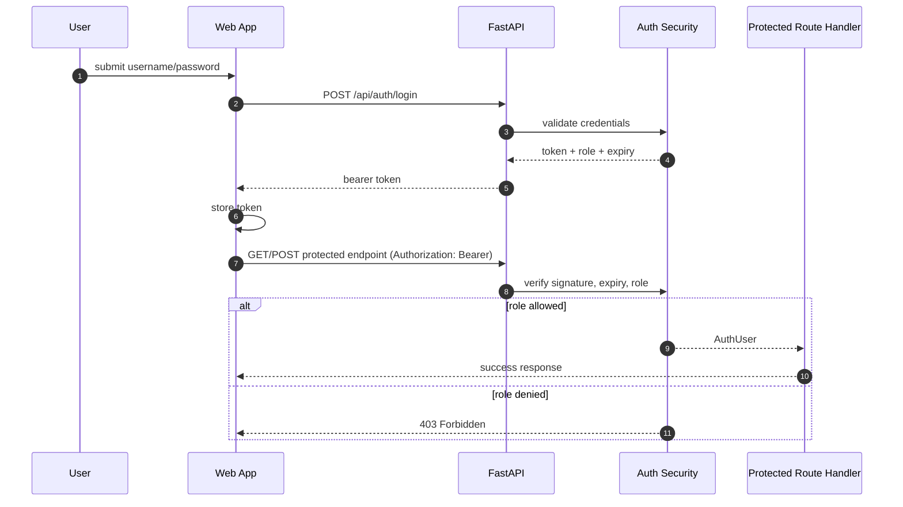
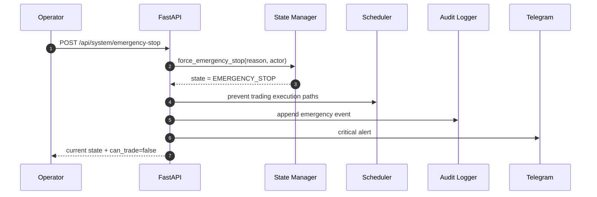

# Sequence Diagrams

This file contains key runtime sequences in Mermaid format.

## 1) Paper Trading Cycle (Scheduler Driven)

## 2) AI Proposal and Human Approval

## 3) Auth + RBAC Protected Request

## 4) Emergency Stop Path

